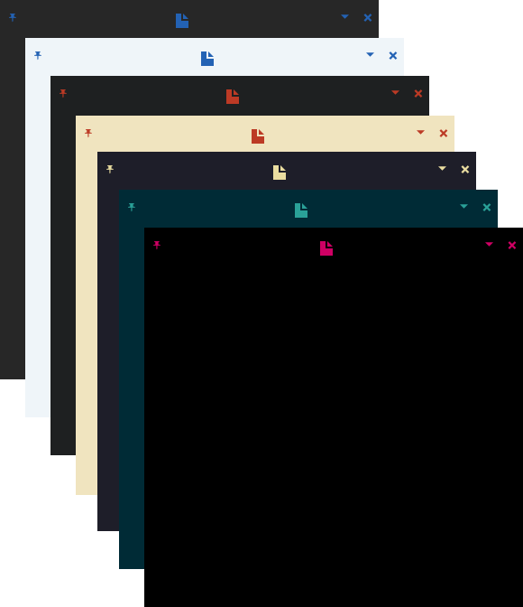
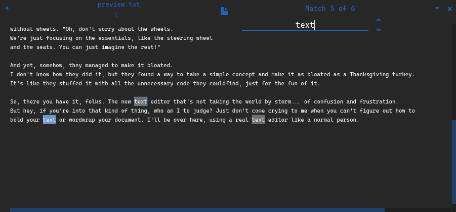
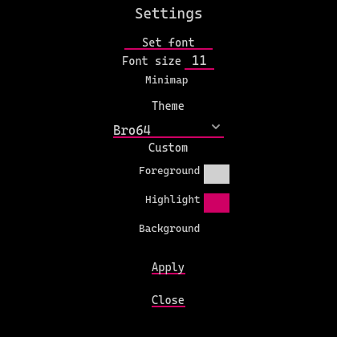

  

<h1 align="center">
  Noter
</h1>

  A text viwer/editor made with Godot.

  

 

<h2 align="center">
  What is Noter and why do I care?
</h2>

So, I decided to create myself a text editor with [Godot](https://godotengine.org/). The new text editor that's
not taking the world by storm... It's lacking all the common features of other editors, heavy, and doesn't run that great.
But hey, if you're into that kind of thing, who am I to judge?
Just don't come crying to me when you can't figure out how to
bold your text or word wrap your document. I'll be over here,
using a [real text editor](https://www.vim.org/) like a normal person.

## Features:
 * Simple customizable UI.
 * Find text.
 * Pin/Always on top.
 * Transparency.

## Shortcuts:
* Ctrl+N to create a new file.
* Ctrl+O to open a file.
* Ctrl+S to save file.
* Ctrl+(Shift)+S to save file as.
* Ctrl+F to find.
* Ctrl+Q to close.

  
## Some more screen shots:
<h4 align="center">
  Find text:
</h4>

 

<h4 align="center">
  Settings:
</h4>

 

### Includes:
[Cascadia Code](https://github.com/microsoft/cascadia-code) font and [Open Iconic](https://github.com/iconic/open-iconic) icons.

